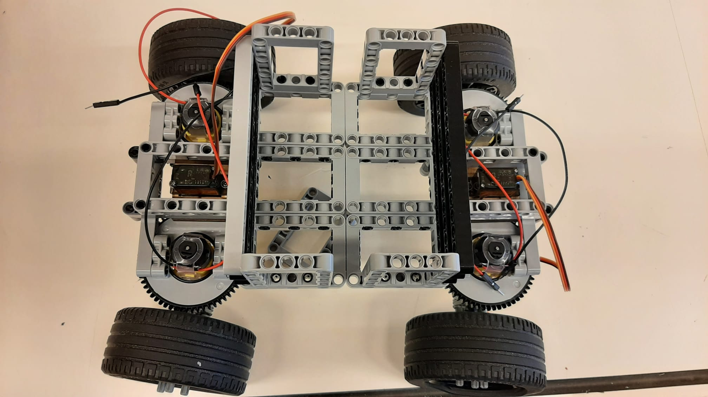
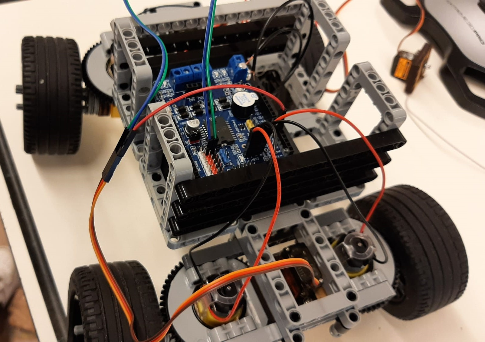

# PWS of Jefta and Job
Concept version of our PWS

## Contents


- [Requirements](#requirements)
- [Installation](#installation)
- [Hardware](#hardware)
- [Usage](#usage)


## Requirements
- Computer with python 3
- WeMos board (or any other esp8266 with WiFi)
- Motor shield
- Servo motor
- Motor
- Battery pack 
- Jumper cables (M-F & M-M)
- Lego Technic

#### [Back to contents](#contents)


## Installation
Install the two libraries: socket, pygame, esptool and mpfshell

```bash
pip install socket
pip install pygame
pip install esptool
pip install mpfshell
```


Now, flash [Micropython](WeMos_Flies/esp8266-20210902-v1.17.bin) on the esp8266.

First, uninstall the current flash.
If you are on Windows, the port is probably `COM3`, for Linux it's probably `/dev/ttyUSB0`
```bash
esptool.py --port {port} erase_flash
```
Now, deploy the firmware.
```bash
esptool.py --port /dev/ttyUSB0 --baud 460800 write_flash --flash_size=detect 0 esp8266-20210902-v1.17.bin
```

After that, put the files: [main.py](WeMos_Files/main.py) & [boot.py](WeMos_Files/boot.py) on the esp8266.
You can use mpfshell for that.

{port} is probably `COM3` on Windows and `ttyUSB0` on Linux
Open the terminal in the folder where the files are located

Windows:
_Run CMD as administrator_
```bash
mpfshell
open {port}
put main.py
put boot.py
```

Linux:
```bash
sudo mpfshell
open {port}
put main.py
put boot.py
```


## Hardware
### Single wheel


### Empty frame


### The wheels put together


### How the WeMos' get connected


### Everything put together


#### [Back to contents](#contents)


## Usage


